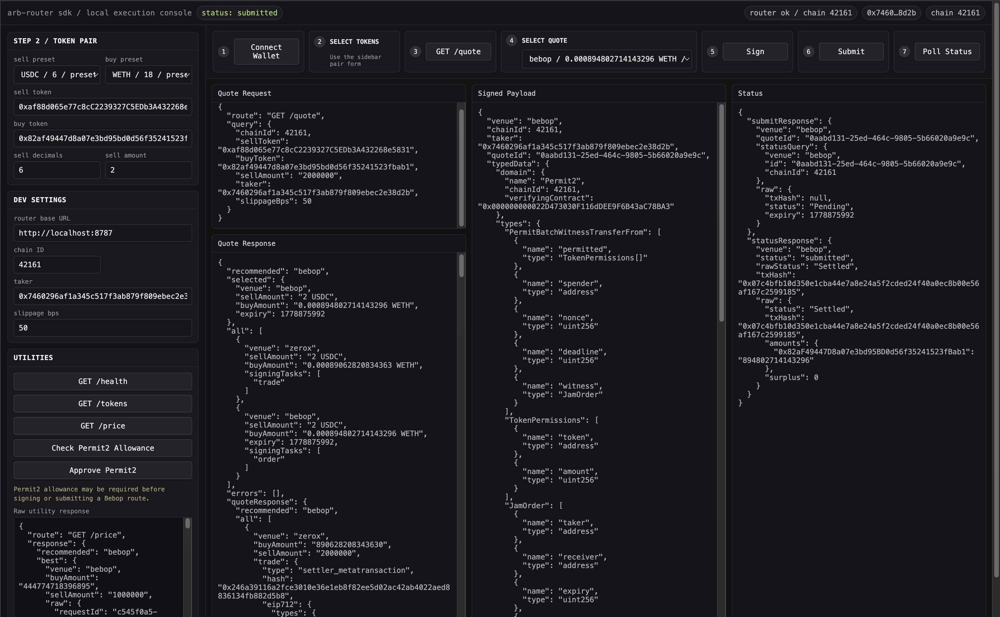

# @arcus-xyz/arcus-spot-sdk

TypeScript SDK for the Arcus spot router server. It wraps the router HTTP API and provides a viem-first signing flow for firm quotes routed through SwapShell — **Arcus RFQ**, **Rialto**, and **LI.FI** venues on Robinhood mainnet (4663) and testnet (46630).

`viem` is the only runtime dependency (a peer dependency); the SDK ships no other runtime deps.

> **Go SDK:** this repo also ships a Go port with the same API surface in [`go/`](./go/README.md) — `go get github.com/arcus-xyz/arcus-spot-sdk/go`.

## Install

Published to the public npm registry — no registry configuration or token required:

```bash
npm install @arcus-xyz/arcus-spot-sdk viem
# or: bun add @arcus-xyz/arcus-spot-sdk viem
```

## Hosted routers

Public router deployments are available — no local setup is needed to fetch quotes:

| Environment       | Base URL                                   | Chain ID | Venues              |
| ----------------- | ------------------------------------------ | -------- | ------------------- |
| Robinhood mainnet | `https://router.spot.arcus.xyz/v1`         | 4663     | arcus, rialto, lifi |
| Robinhood testnet | `https://router.spot.testnet.arcus.xyz/v1` | 46630    | arcus               |

Verify either with the unversioned health endpoint, e.g. `curl https://router.spot.arcus.xyz/health` → `{"ok":true,"chainId":4663,...}`. Self-hosted routers (e.g. `http://localhost:8787/v1`) work the same way — every example below accepts either base URL.

## Authentication

The router gates its endpoints with an API key. Pass the key issued for your
integration and the client sends it as `X-Api-Key` on every request:

```ts
const client = new SpotRouterClient({
  baseUrl: "https://router.spot.arcus.xyz/v1",
  apiKey: "arc_…",
});
```

Keys shipped in a browser or mobile bundle are publishable identifiers rather
than secrets — the server hardens browser keys by pinning them to specific
origins, so use a separate key per client. `apiKey` is optional and can be
omitted against a router that is not enforcing keys.

## Usage

### Robinhood testnet (Arcus)

Point the client at a router serving chain **46630** — the hosted testnet router above, or a locally-run router (`http://localhost:8787/v1`). The wallet must be on chain **46630**. Default mock trade pair: **mUSDG → mTSLA** (fetch token addresses via [`getTokenList()`](#chain-deployments-and-token-list) below).

```ts
import {
  ROBINHOOD_TESTNET_CHAIN_ID,
  SpotRouterClient,
  buildArcusSellTokenPermitIfNeeded,
  erc20ApproveAbi,
  MAX_UINT256,
  PermitUnsupportedError,
  signQuote,
} from "@arcus-xyz/arcus-spot-sdk";
import { createPublicClient, createWalletClient, custom, http } from "viem";

const client = new SpotRouterClient({ baseUrl: "https://router.spot.testnet.arcus.xyz/v1" });
const publicClient = createPublicClient({
  chain: { id: ROBINHOOD_TESTNET_CHAIN_ID, name: "robinhood-testnet" },
  transport: http("https://rpc.testnet.chain.robinhood.com"),
});
const walletClient = createWalletClient({
  account: "0xYourWallet",
  transport: custom(window.ethereum),
});

const quotes = await client.getQuote({
  chainId: ROBINHOOD_TESTNET_CHAIN_ID,
  sellToken: "0xf64780eAE9CFe162EF38f5224459a014a1007cd5", // mUSDG
  buyToken: "0x01206fc62E2e88df71cE4b591e93Bb203383482B", // mTSLA
  sellAmount: "10000000",
  taker: "0xYourWallet",
  slippageBps: 50,
});

const quote = quotes.all.find((q) => q.venue === "arcus");
if (!quote || quote.venue !== "arcus") throw new Error("No Arcus quote");

// Optional: one-time EIP-2612 permit when sellToken→Permit2 allowance is missing
// (returns undefined when the allowance is already set — no signature prompt).
// Non-EIP-2612 tokens can't permit: PermitUnsupportedError describes the one-time
// on-chain approve to Permit2 to send instead; retry after it mines.
let permit;
try {
  permit = await buildArcusSellTokenPermitIfNeeded({ quote, publicClient, walletClient });
} catch (error) {
  if (!(error instanceof PermitUnsupportedError)) throw error;
  const hash = await walletClient.writeContract({
    address: error.token,
    abi: erc20ApproveAbi,
    functionName: "approve",
    args: [error.spender, MAX_UINT256], // spender is always the canonical Permit2
    chain: null,
  });
  await publicClient.waitForTransactionReceipt({ hash });
  // Retry re-reads the allowance on-chain instead of trusting the receipt.
  permit = await buildArcusSellTokenPermitIfNeeded({ quote, publicClient, walletClient });
}

const signed = await signQuote(quote, walletClient, {
  permits: permit ? [permit] : undefined,
});
const submitResponse = await client.submitSignedQuote(signed);
if (submitResponse.venue === "arcus") {
  console.log(submitResponse.txHash, submitResponse.status, submitResponse.orderId);
}
```

`PermitUnsupportedError` also exposes `sellAmount` and `currentAllowance` — USDT-style tokens revert on a nonzero→nonzero approve, so send `approve(0)` first when `currentAllowance` is nonzero. Only contract-shaped failures (missing/reverting `nonces()`) classify a token as non-EIP-2612; transport errors are rethrown so a flaky RPC never downgrades a gasless flow to a gas-costing tx. The rialto and lifi builders share the same behavior.

The SDK accepts the versioned API base URL, for example `http://localhost:8787/v1`, and calls endpoints like `/quote`, `/price`, `/submit`, `/status`, and `/tokens` relative to it. `health()` remains unversioned at `/health`.

Every firm quote includes `fees`, a normalized route-fee array with `amount` in atoms and `token` as the fee token address. Venues with no reported fee return an empty array; Bebop gas/native fees may include `amountUsd` to show the USD value of the fees.

Example `quote.fees` from a firm quote:

```json
[
  {
    "amount": "1500",
    "token": "0xaf88d065e77c8cc2239327c5edb3a432268e5831",
    "type": "volume"
  },
  {
    "amount": "16826",
    "token": "0xaf88d065e77c8cc2239327c5edb3a432268e5831",
    "type": "gas"
  }
]
```

## Chain deployments and token list

Onchain addresses are bundled per chain (published with ABIs in [`arcus-xyz/spot-contracts-abis`](https://github.com/arcus-xyz/spot-contracts-abis)):

```ts
import {
  getChainDeployments,
  getSwapShellAddress,
  ROBINHOOD_TESTNET_CHAIN_ID,
  ROBINHOOD_TESTNET_DEPLOYMENTS,
  SpotRouterClient,
} from "@arcus-xyz/arcus-spot-sdk";

const deployments = getChainDeployments(ROBINHOOD_TESTNET_CHAIN_ID);
// deployments.swapShell, .arcusSettlement,
// .arcusWrappedTokenFactory, .arcusWrappedTokenBeacon, ...

getSwapShellAddress(46630); // => ROBINHOOD_TESTNET_DEPLOYMENTS.swapShell

const client = new SpotRouterClient({ baseUrl: "https://router.spot.arcus.xyz/v1" });
const tokens = await client.getTokenList();
// [{ chainId, symbol, name, address, decimals, source, wrappedTokenAddress? }, ...]
```

| Chain             | ID    | Key exports                                             |
| ----------------- | ----- | ------------------------------------------------------- |
| Arbitrum One      | 42161 | `ARBITRUM_SWAP_SHELL`                                   |
| Robinhood mainnet | 4663  | `ROBINHOOD_MAINNET_DEPLOYMENTS` (no public RPC default) |
| Robinhood testnet | 46630 | `ROBINHOOD_TESTNET_DEPLOYMENTS`                         |

All chains are also available via `getChainDeployments(chainId)` and `CHAIN_DEPLOYMENTS_BY_ID`.

Use `client.getTokenList()` to fetch the router's supported tokens for the configured chain.

Use `getSwapShellTradeHistory()` with `chainId: 46630` (or pass `swapShell` explicitly) to read `SwapExecuted` logs for a taker.

## Wrapped token address prediction

`predictWrappedToken` derives the canonical wrapped representation of an underlying token (e.g. `mTSLA` → wrapped `mTSLA`, or mainnet `WEEK` → `wWEEK`) entirely offline — a pure CREATE2 derivation mirroring `WrappedTokenFactory.predictWrappedToken` on-chain. No RPC calls are made. The address is well-defined whether or not the wrapped token has been deployed yet (the escrow/factory deploys it on the first fill), so treat the result as the canonical address, not proof of deployment.

`predictWrappedTokenForChain` is the convenience form: it reads the configured `WrappedTokenFactory` and beacon for a chain and throws if that chain has no wrapped-token deployment.

```ts
import { predictWrappedTokenForChain, ROBINHOOD_TESTNET_CHAIN_ID } from "@arcus-xyz/arcus-spot-sdk";

const wrappedTsla = predictWrappedTokenForChain({
  chainId: ROBINHOOD_TESTNET_CHAIN_ID,
  underlying: "0x01206fc62E2e88df71cE4b591e93Bb203383482B", // mTSLA
});
```

Use the lower-level `predictWrappedToken` when you need to pass factory/beacon addresses explicitly (e.g. a deployment not bundled in the SDK). Robinhood mainnet (4663) `WEEK` → `wWEEK`:

```ts
import { ROBINHOOD_MAINNET_DEPLOYMENTS, predictWrappedToken } from "@arcus-xyz/arcus-spot-sdk";

const wWeek = predictWrappedToken({
  wrappedTokenFactory: ROBINHOOD_MAINNET_DEPLOYMENTS.arcusWrappedTokenFactory!,
  wrappedTokenBeacon: ROBINHOOD_MAINNET_DEPLOYMENTS.arcusWrappedTokenBeacon!,
  underlying: "0xc93a8c440CEa26D7445dF01729f193b27965099f",
});
// => 0x4B17e556568bB02709a50cA67db7F4DBD46E3d17
```

Pass the `WrappedTokenFactory` proxy and `WrappedToken` beacon for your deployment. Wrong inputs yield a deterministic but incorrect address — the function does not validate chain wiring.

## Local demo



The demo ships presets for the [hosted routers](#hosted-routers), so no router setup is required. Start it with:

```bash
bun install
bun run demo
```

Open http://127.0.0.1:5173, connect an injected wallet, fetch firm quotes, choose one, sign, submit, and poll status.

For Robinhood testnet: select the **testnet** router preset (sets chain ID to **46630** and fills the testnet SwapShell address), connect a wallet on RH testnet, and trade **mUSDG → mTSLA** with the `arcus` venue. The **local** preset (`http://localhost:8787/v1`) remains for self-hosted routers.

## Develop

```sh
bun install        # install dependencies
bun run build      # emit dist/ (tsc)
bun run typecheck  # typecheck src + demo
bun run test       # run the bun test suite
bun run demo       # run the browser demo
```

## Releasing

Publishing is automated by
[`.github/workflows/release.yml`](./.github/workflows/release.yml) using **npm
trusted publishing (OIDC)** — no long-lived npm token is stored in the repo. The
workflow runs on every published GitHub Release (and can be triggered manually
from the Actions tab). It typechecks, tests, builds `dist/`, and publishes to the
public npm registry with provenance attached automatically.

To cut a release:

1. Bump `version` in `package.json` and merge it to `main`.
2. Create a GitHub Release whose tag matches that version. Tags `v0.2.0`,
   `sdk-v0.2.0`, and `arcus-spot-sdk@0.2.0` are all accepted and resolve to
   `0.2.0`; the workflow verifies the resolved version matches `package.json`.

Re-publishing an existing version fails by design, so always bump the version
first.

### One-time setup for OIDC publishing

OIDC trusted publishing cannot perform the **first** publish of a brand-new
package (npm requires the package to exist before its trusted publisher can be
configured). So the very first release is a manual step:

1. **Initial manual publish** (once), from a maintainer's machine with an npm
   login that can publish to the `@arcus-xyz` scope:

   ```sh
   bun install && bun run build
   npm publish --access public
   ```

2. **Configure the trusted publisher** on npmjs.com: open the package →
   **Settings → Trusted Publisher → GitHub Actions**, and set:
   - Organization or user: `arcus-xyz`
   - Repository: `arcus-spot-sdk`
   - Workflow filename: `release.yml`
   - Environment: leave blank (unless you add a GitHub environment gate)

After that, every subsequent release publishes automatically via OIDC — no token,
no manual step.
